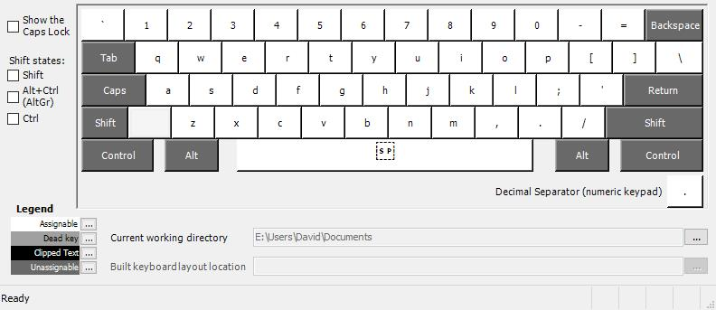
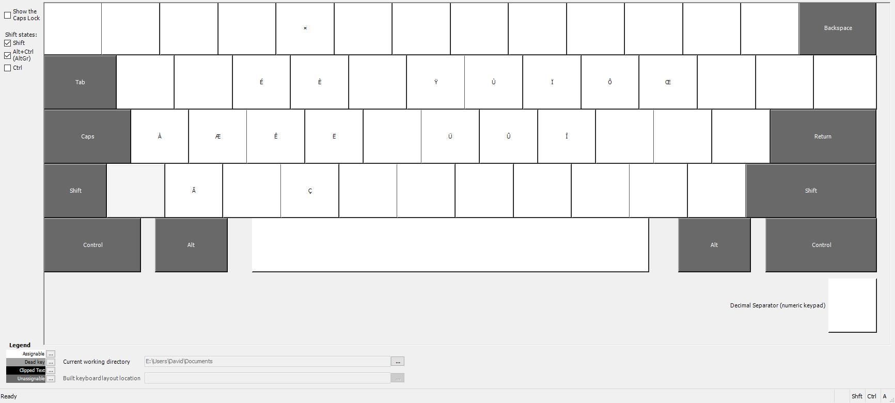

# qwerty-fr

Keyboard layout for qwerty with french accent

Note that it will be installed under the English (United States) language to  match Microsoft VK keys layout.

Clavier qwerty avec les accents français.

À noter que le clavier est installé dans les claviers anglais., sinon windows détecte toujours le clavier comme azerty ce qui peut poser problème lors de l'utilisation des raccourcis tels que ctrl-z / ctrl-w / ctrl-a.

### Base

### Shift Key

### Alt-Gr Key

### Shift + AltGr

